# 自己紹介
はん　しと
韓　　子瞳

- 趣味
  - ドローン
  - 登山
  - およぐ
  - 自転車
  - (チャーハン作る)
  - (サウナ)

---

# 機械学習とは?
<!-- video3 7:20 -->
- データから予測・知識を得るためのコンピュータアルゴリズム。
- 訓練データ（学習データ）を使って学習し、学習結果からタスクを処理する。

---

# 機械学習の目標は”汎化”すること
- 汎化とは過去のデータから未来の状況について正しく予測すること
- 知らないデータが与えられたときに、良い性能を得たい。
  - 学習データに無いからわかりません、、では使えない。
- データの質が高くないと汎化が実現しない。
  - 犬の全容が映った画像で学習させた上で、犬の鼻だけを入力してもなかなか犬だと認識しない。

---

# 機械学習の分類
- **教師あり学習**
  - 分類：クラス分け(故障検知、画像分類、etc)
  - 回帰：連続値の予測(売上予測、需要予測、etc)
- **教師なし学習**
  - クラスタリング：グループ分け(文章分類、顧客セグメンテーション、etc)
  - 次元圧縮：データ次元を下げる(ノイズキャンセリング、データ圧縮、etc)
- **強化学習**
  - 自動運転、囲碁ゲーム、etc
<!-- - （自己教師あり学習） -->
 
---

# 教師あり学習と教師なし学習
||教師あり学習|教師なし学習|
|------|----|----|
| 予測対象が**連続値** |回帰 | 次元削減 |
| 予測対象が**離散値** | 分類 | クラスタリング |

<!-- | 予測対象が**連続値** |回帰、レコメンド | 次元削減 | -->

---
# 用語整理
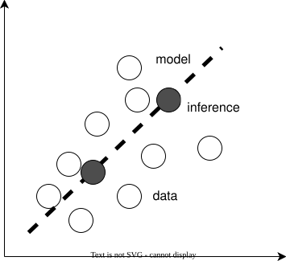
- **モデル**
  - 現象を形容するもの。
- **学習(訓練)**
  - データの近くを通るモデルパラメーターを探すこと。
- **推論**
  - 学習済モデルを使って予測結果を得ること。

--- 
# 用語整理
- **テストデータ**
  訓練した機械学習のモデルを評価するためのデータ
- **特徴量**
  - 機械学習アルゴリズムに入力するデータ$x$を指す。
  - 説明変数、入力変数、独立変数、とも呼ばれる。
- **目的変数**
  - 教師あり学習におけるラベル$y$を指す。
  - 被説明変数、出力変数、従属変数、などとも呼ばれる。

---
# 教師あり学習：回帰

既知のデータとモデルから数値（**連続値**）を予測する。

---
# 教師あり学習：分類
ラベル（**離散値**）を予測する。
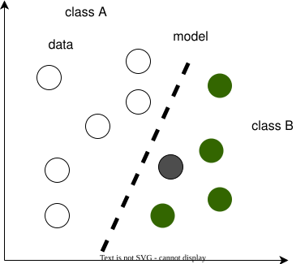

---
# 教師なし学習：クラスタリング
似ているデータを**グルーピング**する。
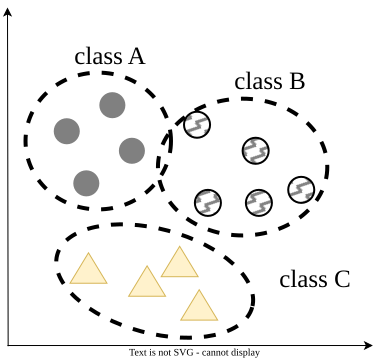
- たいていはグループの解釈が難しい。
- 人がグループを見てラベルをつけれるなら儲けもの。

---
# 教師なし学習:次元圧縮
高次元の情報を低次元に圧縮し利用しやすくする。
- 似たもの同士を近くに集める。
- 特徴を維持しつつデータ量を減らす。
- 例：
t-sneによるMNISTの2次元圧縮
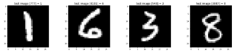
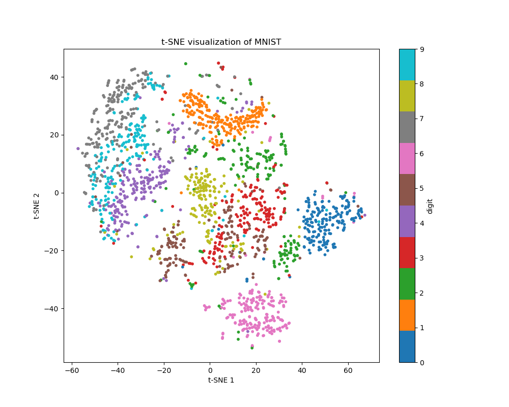

--- 
# 3種類の機械学習
- 教師あり学習
  - 入力と対応ラベルの組$(x,y)$が与えられている。
  - 正常・異常等のデータとラベルが全てのデータに与えられる。
- 教師なし学習
  - 入力$x$のみが与えられている。
  - ラベルが付与されていないデータが与えられる。
- 強化学習
  - データを取得できる環境と、行動パターン、良し悪しの判断基準、が必要。
> (半教師あり学習)
> 入力と対応ラベルの組$(x,y)$が与えられる場合とそうでない場合が混在。

---

# 機械学習は目的変数と特徴量が重要
<!-- video3 37:00 -->
- 目的変数：予測したい値
  - 目的のタスクによって決める場合が多い。
  - 準備するのにコストがかかる場合が多い。だから予測したい。
- 特徴量：目的変数と関係する（と考える）値
  - 用意すべき特徴量は不明なことが多い。
    - 適切な特徴量を選ぶのは難しい問題。
  - 取得にコストがかからない値を選びたい。
    - 手間・金がかかるとシステムとして成立しない。
    - 間接的な関係しない値を渋々使う時、特徴量を別の値に変換したりする。
  - 適当なデータを大量に突っ込んでもほぼ失敗する。
    - 関係ない値を入れても意味ない。ノイズ。

---
# 機械学習のプロセス
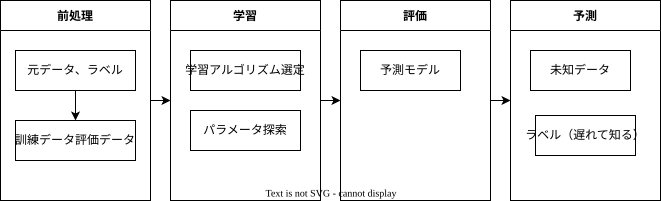
- 運用中に得られるデータにラベル付けできると良い。
  - 使うたびにデータセットが充実。
  - 再学習によって、システムがどんどん賢くなる。
  - 更新済データセットによる再学習で、モデルの時代遅れ化を防止。

---
# 機械学習の考え方
- あくまでデータから複数の特徴量の**関係や傾向を抽出**するもの。
- 機械学習は模倣するというところに重きがある。
  - (基本的に)、予測したい現象が学習データに含まれていないと再現が厳しい。
  - レアデータ(異常データなど)がほしい場合、これを集めるのが大変。
- データは**数値に変換**する必要がある。
  - 中身は数学ロジックで、コンピュータ上で動くので。

---
# 休憩?

---
# モデルの構築方法
<!-- video3 46:45 -->
- データ間の距離による方法
- 大量のif分岐による方法
  - 決定木
- 関数(線・平面)による方法
  - サポートベクターマシン
- 事後確率による方法
  - ロジスティック回帰

---
# ロジスティック回帰
<!-- video3 47:50 -->
<!-- ロジスティック回帰が一番シンプルなのでこっから解説する -->
- 2値分類問題に対する単純で強力なアルゴリズム
  - 名称に回帰とあるが、分類を扱うので注意。
- 計算量が小さくて非常に使いやすい。大量に捌きたかったら費用対効果が高い。
  - 性能を突き詰めていくと、数%の性能を上げるのにものすごく苦労する。
- 産業界でよく使われる
  - 配布したクーポンを利用するかどうか？
  - 企業の過去データを基に借金の返済が可能かどうか？
  - 患者に疾患があるかどうか？

> アド表示のためにロジスティック回帰を採用している例。(2019年)
> [Gunosyデータ分析ブログ](https://data.gunosy.io/entry/advertisement-system-enhancement)

---
# ロジスティック回帰
結局は確率を考えている。
$p$を正事象の確率とする。オッズ比: 事象の起こりやすさを表す。
$${\Large \frac{p}{(1-p)} }$$

正事象のラベルを$y=1$とするロジット関数を定義する。
$${\Large logit(p) = \log{\frac{p}{(1-p)}} }$$

> 結局うしろで確率を考えているよ。
> 正事象は必ずしも良いことを表すわけではなく、機械に故障があるなどの**予測したい事象**を表す。

---
# ロジスティック回帰
<!-- video3 50:20 -->
ロジット関数の入力$p$をどう入れるか考える。
$${ logit(p) = \log{\frac{p}{(1-p)}} }$$

オッズ比自体が入力$x$の関係を線型結合で表すことができるとする。$p(y=1|x)$は入力特徴量$x$が与えられたときに正事象となる条件付き確率、$w$はパラメータを表す。
$$ logit(p(y=1|x)) = \log{ \frac{p}{(1-p)} } = \sum_{i=0}^{m} w_{i}x_{i} $$
<!-- > 全然関係ない入力はノイズでしかないとわかる。 -->

与えられたデータが正事象かを調べたいので、$p$について書き直す。
$$p(y=1|x) = \frac{1}{1 + \exp(-\sum_{i=0}^{m} w_{i}x_{i}) }$$
$$\phi(z) = \frac{1}{1 + \exp(-z)} $$

---
# パラメーターを学習する(お気持ちだけ)
 <!-- video  57:47 -->
データから尤もらしい結果が得られるように**パラメータを学習**してほしい。
一般論として、誤差平方和のコスト関数を考える。$J(w)$が最小となるよう$w$を決める。
ただし、正解ラベル$y$、入力データ$x$、パラメータ$w$

$$ J(w) = \sum_{i=0}^{m} \frac{1}{2} (\phi(x_{i}) - y_{i})^2 $$

> 入力と$y$の相関が強くないと、なかなか近づかなくて（モデルを意味する線が定まらなくて）学習がうまくいかない。

<!-- TODO: お気持ち図 -->

---
# ロジスティック回帰（多クラス分類版）
２種類の方法がある。
1. ovr (One-vs-Rest)
  - 2値分類を何回も繰り返していく。
  - ラベルに対して、「属する」、「属さない」の2値で答えるような問題に適している。
2. multinominal
  - 各ラベルに分類される確率を考慮し、「どれくらい属する可能性があるか」という問題に適している。

> この辺はなんとなく知っておいて、使うときに詳しく調べれば良い。

---
# バイアスとバリアンスの概念
<!-- video4 12:00 -->
- 予測誤差の種類
  - バイアス
    - 正解からのズレ/偏り
  - バリアンス
    - 散らばり具合

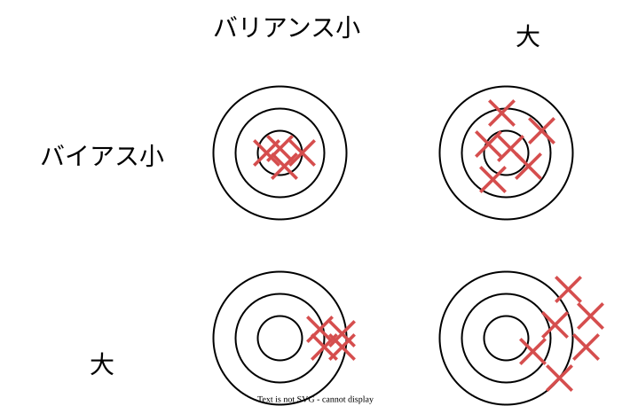

> 予測誤差が小さいほど良い機械学習モデルができる。
> 実際はこれらにトレードオフの関係があるので調整作業が必要。
<!-- > こんな作業があるんだと理解しておく。 -->

---
# 正則化
<!-- video4 15:18 -->
コスト関数に正則化項を追加することでモデル形状の複雑化を防止する。
- 過学習しづらくなる。
<!-- - 特徴量をうまく選択させられる。 -->
- 入力した特徴量の中から、勝手に重要な数個を選んでくれる。(L1)
- どの特徴量を選ぶかは難しい問題。
  - 何が起きているかの現象がイメージできれば参考にできる。
  - 領域に関する知識が少ないと、どれを入れていいか全然わからなかったりする。
  <!-- - 現場の方などから有識者に説明してもらいながら、特徴量を選択する。信頼してもらえないと話を聞けなかったりするらしい。 -->

> 制約条件っぽく作用する項を入れて解を絞ってる。
> 正則化項の入れ方によって, LASSO, リッジ とか呼ばれてる
> 正則化を使うときは特徴量を標準化してあげないといけないことに注意。

---
# 演習
ロジスティック回帰の演習

---
# (線形)サポートベクターマシン
**マージンを最大化**することで分離平面を決定する。
1. 一番近いもの（サポートベクター）を選択してくる。
2. 各サポートベクターから遠くなるように線(平面)を押し合う。

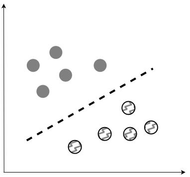
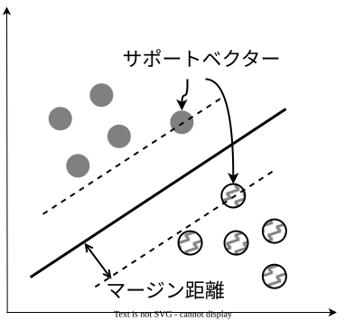
> ロジスティック回帰では誤分類率が最小になるように分離平面を決定していた。

---
# (線形)サポートベクターマシン
識別マージンを$\kappa$とすれば、全ての訓練データで以下が成り立つ。
$$ |\mathbf{w}^{T} \mathbf{x}_{i} + b| \ge \kappa $$

係数ベクトルとバイアス項を$\kappa$で正規化したものを改めて$\mathbf{w},b$とすれば、以下のようになる。
$y_{i} = +1$ のとき、$\mathbf{w}^{T} \mathbf{x}_{i} + b \ge +1$
$y_{i} = -1$ のとき、$\mathbf{w}^{T} \mathbf{x}_{i} + b \le -1$
$$\Rightarrow y_i(\mathbf{w}^{T} \mathbf{x}_{i} + b) \ge 1 $$

マージン距離が$\frac{1}{|\mathbf{w}|}$と求まる。実際には計算の都合で$\frac{1}{2} |w|^{2}$とする。

> マージン距離を最大化したいと言うのは、逆数とって最小化しても同じ。
> 凸最適化問題として解くために２乗し、勾配を計算したときに係数を消すために1/2がついてる。

<!-- > マージンを大きくすると汎化誤差が小さくなる傾向にある。 -->
<!-- > マージンが小さいと過学習になりやすい。 -->

---
# サポートベクターマシン
これまで標本が線形分離可能であると仮定したが、実際は成立しづらい。
スラック変数$\xi$を導入してこの仮定を緩和する。

$$
\begin{aligned}
\min_{\mathbf{w}, \gamma} \quad & \frac{1}{2} \|\mathbf{w}\|^2 + C \sum_{i=1}^{n} \xi_{i} \\
\text{s.t.} \quad & (\mathbf{w}^T \mathbf{x}_i + \gamma) \le 1 - \xi_{i} \\
                  \quad & \xi_{i} \ge 0 \quad  \forall i = 1,2,\dots,n \\
\end{aligned}
$$

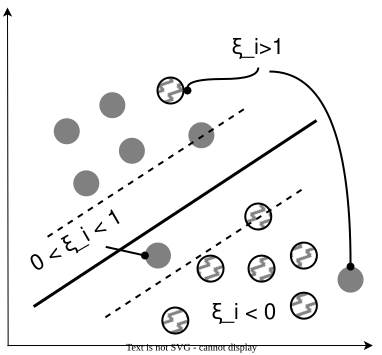

<!-- > $C \gt 0$は誤差の許容具合を表す調整パラメータ。大きくすると、$\sum_{i=1}^{n}$がゼロに近づき、ソフトマージンSVMがハードマージンSVMに近づく。 -->
> scikit-learnでも$C$というパラメーターが該当する

---
# ロジスティック回帰とSVM
<!-- video4 42:00 -->
- ロジスティック回帰と線形SVMは似たような結果になりやすい。
  <!-- - 単純な構造なので実装・改良しやすい
  - 更新が簡単なのでリアルタイムデータ処理に向いている -->

- ただ、SVMは曲線が引けるところに良さがある。
  - ロジスティック回帰を利用していればSVMは不要というわけではなく、非線形問題こそ（カーネル）SVMの良さが発揮できる
  - グネグネした線を引くためにカーネルという技術を使う。(別空間で超平面を引くが、元の空間に戻したら曲線)

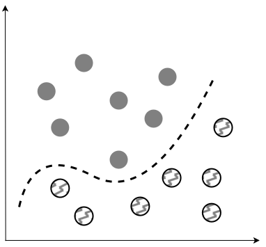

---
<!-- # 非線形問題を解くためのカーネル法 -->
# カーネル法
<!-- video4 44:00 -->
- データをうまく変換した先(**高次元空間**)で分離境界を見つけるというのがカーネル法のアイディア。
- データが複雑なほど良い変換を見つけるのは職人技。
- 誰でもうまく扱う仕組みがカーネル法。
  - 線形, 多項式, RBF, etc
  - RBFカーネル
  $$K(x_i, x_j) = \exp(-\gamma ||x_i-x_j||)^2 \gamma > 0$$
> 実際はSVMの双対問題を考えることでデータ同士の内積だけで主問題の最適解を構築可能。

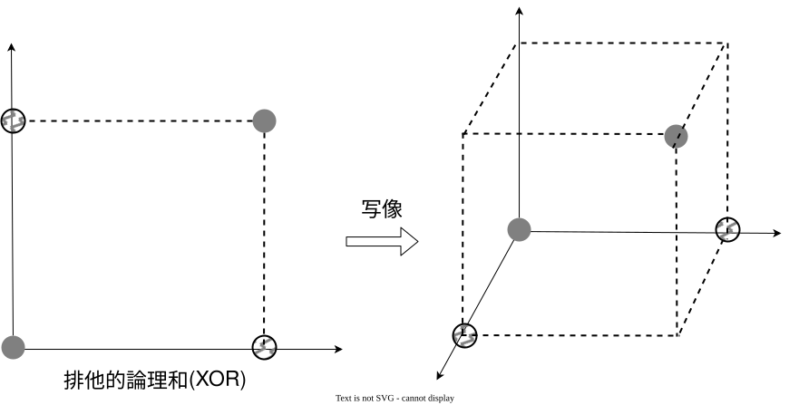

<!-- > カーネルのやっていること自体はそんなに難しくない。 -->
<!-- > 主成分分析、k-means などとも組み合わせて使える。 -->

---
# サポートベクターマシン
<!-- video4 35:35 -->
- 深層学習が出る前まで、分類と言ったらSVMが主役だった。
- アカデミックでは下火かもしれないが、産業界ではまだまだ使われる。
- 深層学習に比べて計算が軽いし準備が手軽。

> TikTokにおけるレコメンデーションシステムに、SVMが３回使われている。
> [Catherine Wang. why TikTok made its user so obsessive? The AI Algorithm that got you hooked.](https://medium.com/data-science/why-tiktok-made-its-user-so-obsessive-the-ai-algorithm-that-got-you-hooked-7895bb1ab423)

---
# 演習
サポートベクターマシンの演習

---
# 決定木
<!-- video4 23:00 -->
中身は大量のif文を組み合わせたアルゴリズム。
その条件式とツリー構造を下記手順の繰り返しによってデータから算出する。

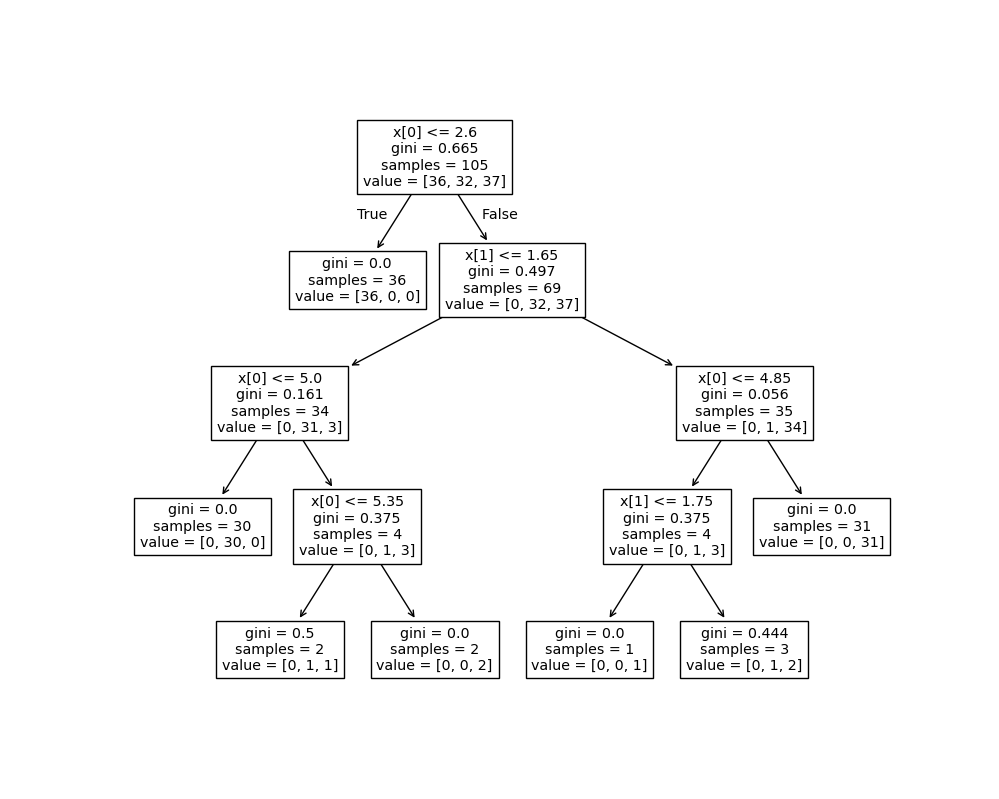

1. 木の構築
   - 予め定義したコストに基づき、特徴空間を2分割
2. 剪定
   - 予め設定したパラメーターに基づき、構築した木を剪定

> 昔は有識者から条件式を聞いてたりしていたらしい。

---
# 決定木
- メリット
  - 分岐条件が可視化できる。実務上の説明責任が果たしやすい。
  - 欠損値があっても利用可能
  <!-- - 計算が比較的高速 -->
  - 説明変数、目的変数に様々な尺度が扱える
    - 決定木の分岐は入力値を**閾値と比較する**処理であり、入力値の大小関係や等間隔性を前提とした演算を行わない。
    <!-- - そのため、名義尺度（血液型など）を整数に変換して入力しても、線形モデルのように誤った順序・距離の情報がモデルに持ち込まれにくい。 -->
- デメリット(決定木だと特に起こりやすい)
  - データの変化に対して敏感
  - クラスごとのデータ数に隔たりがあるデータは特に不得意

> 発展形アルゴリズム：LightGBM
  <!-- - エクセルで読めるデータを扱うときはデファクトだと言われるくらい使われる。
  - 数値データを扱うときは性能上位に来る常連アルゴリズム。-->

---
# 演習?

決定木の演習

---
# 前処理が必要
- どんなに優れた技術でも**ゴミを入れればゴミが返ってくる**。
- データ分析には品質の高いデータは、予測モデルを作る上での大前提！
- データの正常性を担保するための処理が前提。
- 実データは様々なソースやプロセスから収集されるため完全性が担保されていない。
  - ヒューマンエラーによる入力ミス
  - データの破損・不規則・不整合・異常データの読み込み
  - データに重畳するノイズ

---
# 欠損値があるデータ
データが十分にあれば、１つでも欠損値のあるレコードは分析から除外したほうがいい。
- 基本的に欠損を含むデータはノイズなので消したほうがいい。
- 欠損部は０で埋めるような挙動をするライブラリが多いので注意すべし。
- 欠損部を代表値等で埋めてもいいが、結構バイアスが入ることが多い。できれば避けたい。
- 欠損埋めに機械学習を使うなど、方法もあるがゴールが遠のくので微妙。。
やるなら、尺度に注意しましょう。
  - 連続値は**回帰**で補完。
  - 離散値は**分類**で補完。

---
# カテゴリデータの処理
数値データしか扱えないから、工夫して数値に変換してね。という話。
- 名義尺度の変換
- 順序尺度の変換
- データの種類について

> 変換にどの手法が良いとか決まった答えはない。やってみないとわからん。

---
# 名義尺度の変換
名義尺度とは単に区別するために用いる尺度で、順番に意味はない。
|　社員ID　|　年齢　|　性別　|　役職 |
|---------|------|-------|------|
| 001 | 54 | 男性　| 部長　|
| 002 | 37 | 女性　| 課長　|
| 003 | 31 | 男性 | 担当　|
| 004 | 20 | 女性　| 担当　|

|　社員ID　|　年齢　| 男性フラグ　|　女性フラグ　|　役職 |
|---------|------|-----------|------------|------|
| 001 | 54 |  1 | 0 | 部長　|
| 002 | 37 |  0 | 1 | 課長　|
| 003 | 31|  1 | 0 | 担当 |
| 004 | 20 |  0 | 1 | 担当　|

---
# 順序尺度の変換
|　社員ID　|　年齢　|　性別　|　役職 |
|---------|------|-------|------|
| 001 | 54 | 男性　| 部長　|
| 002 | 37 | 女性　| 課長　|
| 003 | 31 | 男性 | 担当　|
| 004 | 20 | 女性　| 担当　|

|　社員ID　|　年齢　|　性別　|　役職 |
|---------|------|-------|------|
| 001 | 54 | 男性　| 3　|
| 002 | 37 | 女性　| 2　|
| 003 | 31 | 男性  | 1　|
| 004 | 20 | 女性　| 1　|

---
# 特徴量の尺度
- 定性的データ
  - **名義尺度**： 他と区別するためだけの記号（名称）
    - 名前、性別、血液型、電話番号
  - **順序尺度**： 順序や大小に意味があって、間隔には意味がないもの。
    - レースの着順、役職
- 定量的データ
  - **間隔尺度**：　目盛りが等間隔で、その間隔に意味があるもの。
    - 摂氏、華氏、西暦、
  - **比例尺度**：　０が原点で、間隔と比率に意味があるもの。
    - 身長、体重

---
# 特徴量の尺度
|     |　大小比較　|　差　|　比　|
|-----|------|-------|------|
| 名義尺度 | ×　| ×　| ×　|
| 順序尺度 | ○　| ×　| ×　|
| 間隔尺度 | ○　| ○　| ×　|
| 比例尺度 | ○　| ○　| ○　|

> 尺度に応じてできる操作が決まっているのでデータ分析の際は意識する。
> わけわからん特徴量を作らないようにしましょう。

---
# 特徴量の尺度
- 特徴量に使うデータの**大きさの範囲**を揃えましょうという話。
- 実際は各カラムの値の範囲がバラバラ。
- そのまま扱っても良いアルゴリズムもあるが, そうでないなら値が大きなデータに引っ張られてしまう。
- 基本的には、正規化、標準化して揃える。

---
# 標準化
正規分布（平均0, 標準偏差1）となるようにスケール変換する。
データ$\{x_{(1)},x_{(2)},x_{(3)}, \dots , x_{(N)}\}$
を標準化するには平均値$\bar{x}$と標準偏差$\sigma$を利用して次式で変換する。
$$\tilde{x_{(i)}} = \frac{x_{(i)} - \bar{x}}{\sigma}$$

> データの大部分が$\pm 2\sigma$ 以内に集約されるのが嬉しい。

---
# 正規化
最小値0,最大値1 となるようにスケール変換する。
データ$\{x_{(1)},x_{(2)},x_{(3)},\dots,x_{(N)}\}$を正規化するには最大値$x_{max}$を最小値$x_{min}$を利用して次式で変換する。
$$ \tilde{x_{(i)}} = \frac{x_{(i)} - x_{min}}{x_{max} - x_{min}} $$

<!-- アルゴリズムごとに相性がある。らしい。 -->

---
# データセットの分割
データセットは、学習用、テスト用、検証用に分けましょう。
- 学習用：モデルパラメータのチューニングに使う
- テスト用：学習がうまくいってるかの判断に使う。
- 検証用：リリースしたときの模擬データとして活用する。

> データが十分なら60:20:20くらいの割合で分ける。ただし割合は目安。

> 時系列データを扱う時は**データリーク**に注意。
> 未来を予測したいのに、学習時にその情報を与えることで、見かけ上うまく学習できてしまう。

---
# 休憩?

---
# 強化学習
<!-- video6 28:00 -->
強化学習では、データの代わりに「環境」と「報酬」からエージェントが「価値」を最大にする行動を学習する。

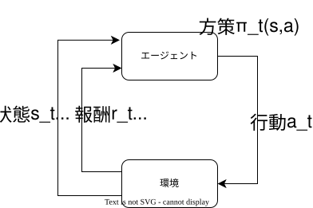

- エージェントは状態$s$において行動$\alpha$を決定（方策）する必要がある

> 教師あり学習では事前にデータとラベルから、入出力の関係を学習する。

<!-- ロボット制御だとどうなるか？
環境：擬似的な仮想空間、など
報酬：スコア。ものをつかめたら+。壊したらマイナス。など。
方策： -->
<!-- 報酬の設定が難しい問題。問題設定によって与え方を考えないといけない。 -->

---
# 強化学習
メリット
- 教師データ不要
- 状態遷移を伴う問題を扱える。
- 環境と報酬の定義ができればよい。

デメリット
- リアルな試行錯誤可能な環境を用意する必要がある。
- 学習の概念が探索に変わってるので試行錯誤の時間がかかる。
- 状態の数が膨大になると探索に時間がかかる。

---
# 方策の2大柱
<!-- video6 40:45 -->
方策における重要項目は**利用**と**探索**。
- 利用は今まで集めてきた知識をどう利用するか。
- 探索とは未知の対象に対してどう扱うか。
これらを数学的に定式化して利用していく。

> 利用と探索はトレードオフ

---
# マルコフ決定過程
<!-- video6 42:30 -->
強化学習が扱う問題はマルコフ決定過程として定式化される
時刻$t$のエージェントの状態を$s_t$,行動を$a_t$とすると
$$\{S_0, A_0, R_0\}, \{S_1, A_1, R_1\},,,$$

ここで、$R_{t+1}$は行動$A_t$を取った後に得られる報酬を表す。
$$ p(s', r|s,a) ≡　P(S_{t+1} = s', R_{t+1} = r|S_t = s, At=a)$$
遷移後の状態$s'$,得られる報酬$r$は現在の状態$s$と行動$a$のみに依存する。（過去の状態や行動には依存しない）

この遷移確率を定義できるものを**モデルベース**、そうでないものを**モデルフリー**の手法と呼ぶ。

> 一個前の状態、アクションによって次の状態が決まる。
<!-- > 走ってたら次の状態も走ってそう。一回ジャンプしたら次はジャンプしない。等。 -->

---
# 状態遷移確率
遷移後の状態$s'$を考える。$s'$は現在の状態$s$と行動$a$のみに依存するため、
$$ p(s'|s,a) ≡ P(S_{t+1} = s'|s_t = s, A_t = a) $$
と定義できる。つまり、報酬$r$の周辺確率として計算できる。

$$ p(s'|s,a) ≡ \sum_{r \in \hat{R}} p(s', r|s, a) $$

この条件付き確率を状態遷移確率と呼ぶ。

<!-- > 要は確率を使ってうまく計算していきましょう。と言いたいだけ。 -->

---
# 強化学習

強化学習の演習

---
# 演習: 概要
- ベアリング製造機がある。仕様は以下の通り。
  - **電源ボタン**と**製造ボタン**の2つのボタンがある。
  - 電源ON/OFF を表す**電源ランプ**が1つある。
  - 電源ランプがONのときのみ、製造ボタンを押すことでベアリングが製造できる。
  - ボタンの同時押しは出来ない。
- 最も効率よくベアリングを製造するためのボタンを押す順序を学習することが目的。
- 正解行動
  - 「電源OFFのときは電源ボタンを押し、電源ONのときは製造ボタンを押す」

---
# 演習: Q学習
- 下記の更新式で自ら試行錯誤すると適切な**方策**(Q値matrix)を得られると知られている。
$$ Q(s,a) \leftarrow (1-\alpha) Q(s,a) + \alpha \{ r(s,a) + \gamma \max_{a'} Q(s',a') \} $$

> $Q$ : Q値(次の行動を決める指標)
> $\alpha$: 学習率 $0 < \alpha < 1$ 
> $\gamma$: 割引率 $0 < \gamma < 1$ 
> $s, s'$ : 状態(現在、未来)
> $a, a'$ : 行動(現在、未来)
> $r$ : 報酬

---
# 演習: プログラム設計の方針
<!-- $$ Q(s,a) \leftarrow (1-\alpha) Q(s,a) + \alpha \{ r(s,a) + \gamma \max_{a'} Q(s',a') \} $$
- Q値の更新に必要な関数たち
  - $\max Q(s',a')$を計算する関数。
  - Q-matrixに応じた最適な行動$a$を計算する関数。
  - 報酬r(s,a)を計算する関数。
- 学習した方策の実行に必要な関数たち
  - Q-matrixに応じて
  - 
- Agent
  - 方策(Q値テーブル)を保持

- nachi_machine(環境)

Q(s,a):更新前のQ値
r(s,a):得られた報酬
Q(s',a'):遷移した先の状態の価値。

Q学習は、実際に観測した経験だけを使っているのでモデルフリーの手法
 -->

