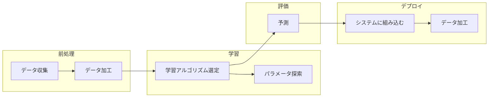

```mermaid
flowchart LR
  subgraph Phase1["前処理"]
      A1[データ収集]
      A2[データ加工]
      A1 --> A2
  end
  subgraph Phase2["学習"]
      B1[学習アルゴリズム選定]
      B2[パラメータ探索]
      B1 --> B2
  end

  subgraph Phase3["評価"]
      C1[予測]
  end
  subgraph Phase4["デプロイ"]
      D1[システムに組み込む]
      D2[データ加工]
      D1 --> D2
  end

A2 --> B1 --> C1 --> D1

```

